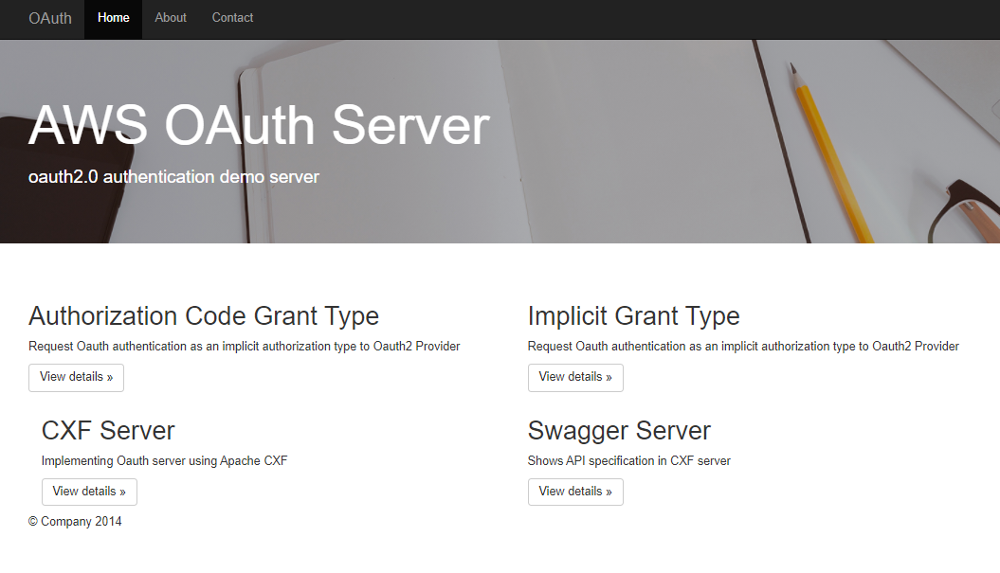
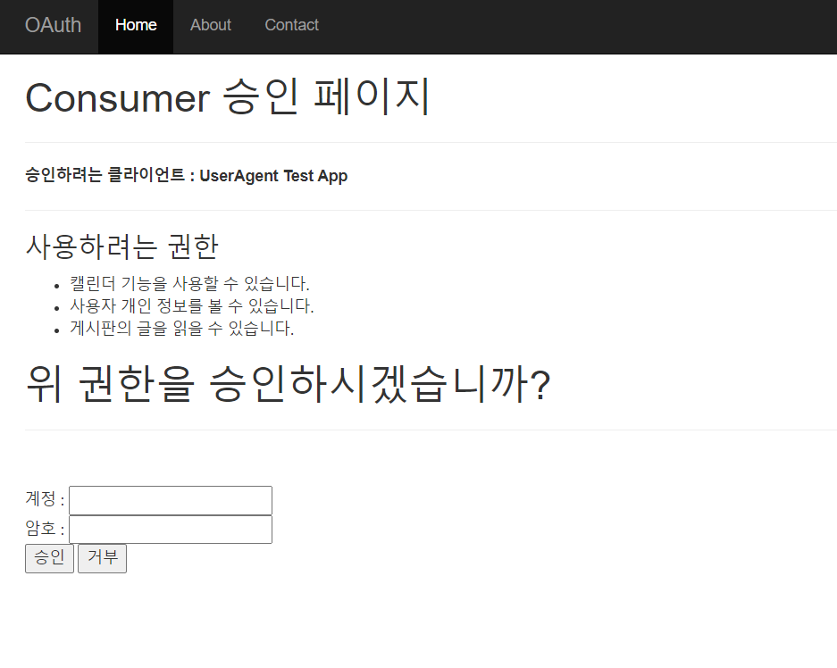

# AWS OAuth2 Server
## open api developers  
http://ec2-52-78-1-158.ap-northeast-2.compute.amazonaws.com:8081/  
   
   
   
   
   
*Library List*
* spring-boot-starter-parent / 2.4.0
* spring-boot-starter-data-jpa / -
* spring-boot-starter-web / -
* spring-boot-devtools / -
* jstl / -
* tomcat-embed-jasper / -
* ojdbc6 / 11.2.0.4
* lombok / -
* springdoc-openapi-ui / 1.5.0
* commons-httpclient / 3.1
* jackson-mapper-asl / 1.9.1
* spring-boot-starter-test / -  
  
## AWS OAuth2 Server
http://ec2-52-78-1-158.ap-northeast-2.compute.amazonaws.com:7070/

- authorization-server : oauth 인증 서버 (인증 계정 : gdhong/gdhong )
- client-server : Authorization Code Grant Type 요청
- client-agent-server : Implicit Grant Type 요청
- cxf-server : cxf를 사용한 oauth 서버 구현 (인증 계정 : test/test )
- swagger-server : aws에서 서비스하는 API 확인 

## Client Server  
1.Authorization Code Grant Type 요청 to OAuth Provider  
     

2. 사용자 로그인   
       
 
## Client Agent Server   
1. Implicit Grant Type 요청 to OAuth Provider      
    

2. 사용자 로그인    
    

## CXF Server
Authorization code Grant Type
- STEP1. Issue Authorization Code
- STEP2. Issue Access Token
- STEP3. Call Api
   1. REST
   2. SOAP
  

## Swagger
- 스웨거(Swagger)는 Open Api Specification(OAS)를 위한 프레임워크
- API들이 가지고 있는 스펙(spec)을 명세, 관리할 수 있는 프로젝트
  

## SAAJ 

- 사용자가 직접 SOAP 메세징 애플리케이션을 작성할 수 있는 API
- JAX-RPC를 사용하지 않고 SOAP 메시징 응용 프로그램을 직접 작성하도록 선택할 때 사용할 수있는 API
- SAAJ를 사용하여 메소드를 호출함으로써 사용자는 SOAP 기반 XML 메세지를 읽고 작성할 수 있으며,  인터넷을 통해 이런 타입의 메세지들을 주고받을 수도 있다.

1. soapEndpointUrl  : soap service url
2. soapAction : soap service action
3. Namespace  : 사용자 정의값
4. NamespaceURI  : service Class targetNamespace에 정의된 값 
5. elementName : wsdl operationName 
6. childElementName : WebMethod의 파라미터 name
7. childElementValue : WebMethod의 파라미터 value

## JAXB

- JAXB는 자바의 객체를 XML로 직렬화하여 Client에게 전송해주고 Client가 보낸 요청 XML을 다시 자바 객체로 역직렬화해주는 자바 API
- Java 어노테이션을 사용하여 XML과 Java 간의 맵핑을 빌드
- JDK6 ~ 9 버전은 JAXB가 내장되어 있어 라이브러리를 추가 할 필요가 없습니다. 
- WebService의 VO(Value Object) 클래스에서 JAXB Annotation 사용하여 작성

## WS-Security

- TCP/IP 레벨의 전송 레벨의 보안이 아닌 메시지 자체에 대해 보안을 적용
- 메시지의 일부만을 암호화
- 다중 인증서를 사용 가능
- 복수 개의 보안 토큰 허용 : 인증서 + 아이디/패스워드
- 엔드-투-엔드 메시지 기반 
- PKI(Public Key Infrastructure, 공개 키 기반) 기반 암호화 기반
- X509(인증서) 기반
-  메시지 서명 

       참고 WS-Security 웹서비스 보안
       http://credemol.blogspot.com/2010/07/ws-security.html
       
       참고 Java Keytool을 키스토어 생성 및 공개키 방식의 키 쌍 생성
       https://m.blog.naver.com/wndrlf2003/220649843082
       
       참고	Secure Web Services Message using WSE 2.0 데이터 기술 자료
       https://www.kdata.or.kr/info/info_04_view.html?field=&keyword=&type=techreport&page=334&dbnum=126630&mode=detail&type=techreport
       
       참고 Spring CXF Webservice SSL 적용
       http://blog.naver.com/PostView.nhn?blogId=catchbug&logNo=20129493671&redirect=Dlog&widgetTypeCall=true&directAccess=fals
